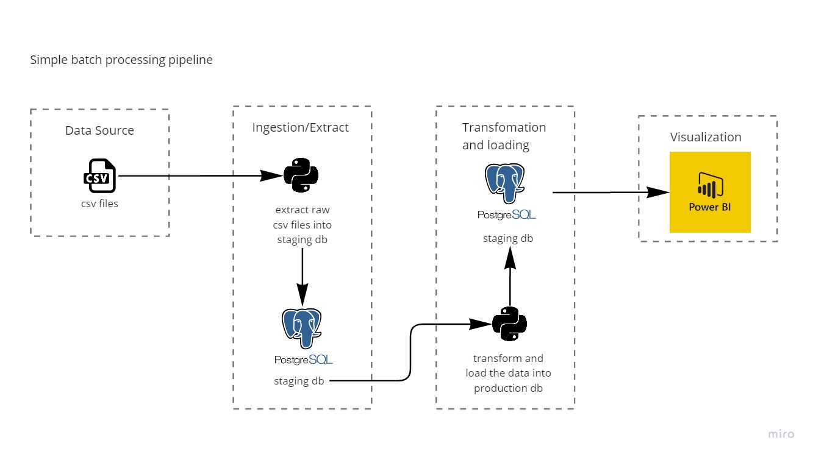

# sof_sa
## Analyzing past and current trends in software engineering and development using Stack Overflow Developer Survey data

### Table of Contents
- Introduction
- What I learned
- Project Architecture
- Getting Started
    - Prerequisites
    - Installation
    - Configuration
    - Running the project
    - Built with
- Results
- Next steps
- Author 

## Introduction 
Performing exploratory data analysis on data from the StakeOverFlow developer survey from the years 2018 to 2021 in order to better understand developer's choice of tech stack. 

To get this understanding the following questions are asked:
- Question 1 Which programming languages have gained popularity from 2018 to 2021?
- Question 2 Which database services have gained popularity from 2018 to 2021?
- Question 3 Which cloud platforms have gained popularity from 2018 to 2021?
- Question 4 Which web frameworks have gained popularity from 2018 to 2021?

## What I learned 

- How to extract, transform and load data using pandas and Numpy 
- Data Modelling 
- Writing SQL queries and how to execute SQL in python 
- Using Postgres with python

## Project Architecture 

## Getting Started

These instructions will get you a copy of the project up and running on your local machine.

### Prerequisites

-  Virtualenv for package management

        python -m pip install --user virtualenv
    More details about virtualenv [here](https://virtualenv.pypa.io/en/latest/user_guide.html#introduction)

- An active instance of PostgreSQL on your local machine or on the cloud 
    To install PostgreSQL on your local host follow the instructions provided in the official documentation [here](https://www.postgresql.org/docs/current/tutorial-install.html)
    For cloud based instances follow the instructions provided by the cloud provider.

- The data used in this project was downloaded from [StackOverflow](https://insights.stackoverflow.com/survey)

### Installation

        git clone <repo>
        cd <repo>
        virtualenv venv 
to create your new environment (called 'venv' here)

        source venv/bin/activate 
to activate the virtual environment

        pip install -r sof-sa\src\requirements.txt 
to install the requirements in the current environment.

### Configuration
For more information on configuration see this [README](sof-sa\conf\README.md)

### Running the project

        >> kedro run -p load_data
 
- This runs a pipeline that loads data into the staging database. 

        >> kedro run -p languages_pipeline 
        >> kedro run -p databases_pipeline
        >> kedro run -p cloud_platforms_pipeline
        >> kedro run -p web_frameworks_pipeline
- These commands run all the available pipelines and are to be executed separately.
        
- Check [exploration.ipynb](sof-sa\notebooks\exploration.ipynb) in the notebooks folder for a more detailed explanation of the etl process. 

For more detailed information about the project you will have to build the docs, as follows

        >> cd sof-sa && kedro build-docs
then open `sof-sa\docs\build\html\index.html` in your browser

### Built With

- Python - ETLprocess
- PostgreSQL - Data Storage
- virtualenv - Package management
- Power BI - Data Visualization

## Results

The main findings of the report can be found [here](Report.pbix).

## Author 

- Zibusiso Mangoye
    [linkedIn](https://www.linkedin.com/in/zibusiso-n-mangoye/)

## License
This project is offered under the GNU GENERAL PUBLIC LICENSE V3, 2007 for more read [LICENSE](LICENSE) 
