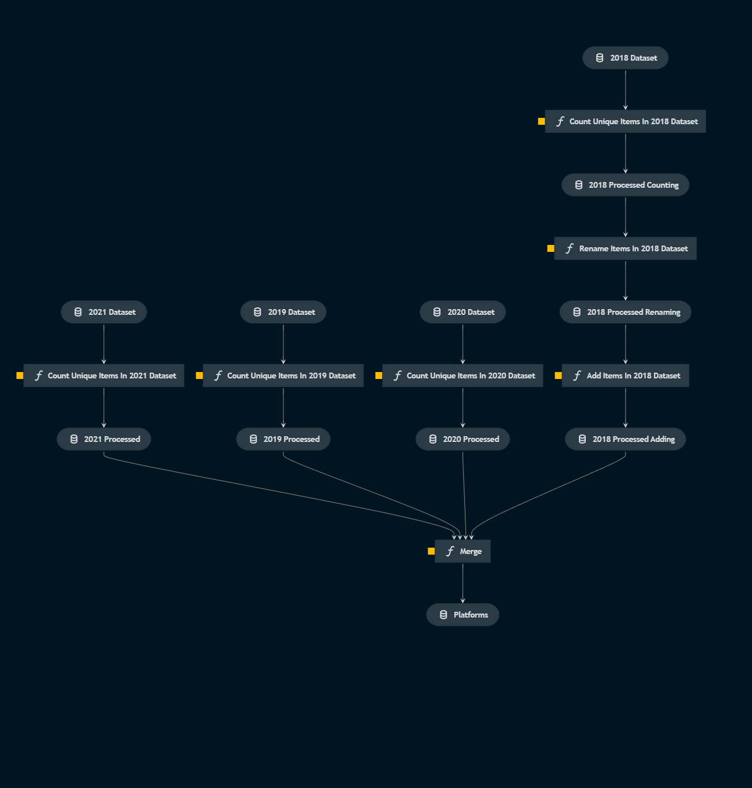

# Pipeline databases

> *Note:* This is a `README.md` boilerplate generated using `Kedro 0.18.2`.

## Overview
This pipeline:
- Uses a SELECT query to filter columns from a staging database based on year
    - A [MemoryDataSet](https://kedro.readthedocs.io/en/stable/kedro.io.MemoryDataSet.html) are returned for each year
- For each year
    - The databases column is filtered
    - Transformed 
- The transformed datasets are merged into a table `databases`

## Flow
*Flow of the full pipeline visualized*
