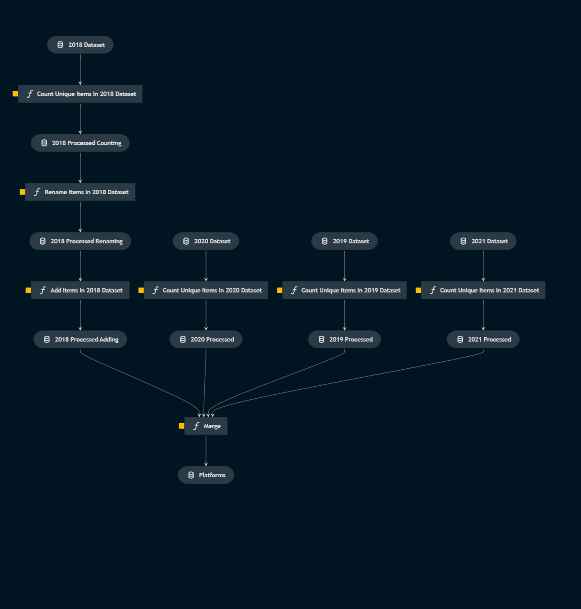

# Pipeline web_frameworks

## Overview

This pipeline:
- Uses a SELECT query to filter columns from a staging database based on year
    - A [MemoryDataSet](https://kedro.readthedocs.io/en/stable/kedro.io.MemoryDataSet.html) are returned for each year
- For each year
    - The web_frameworks column is filtered
    - Transformed 
- The transformed datasets are merged into a table `web_frameworks`

## Flow
*Flow of the full pipeline visualized*